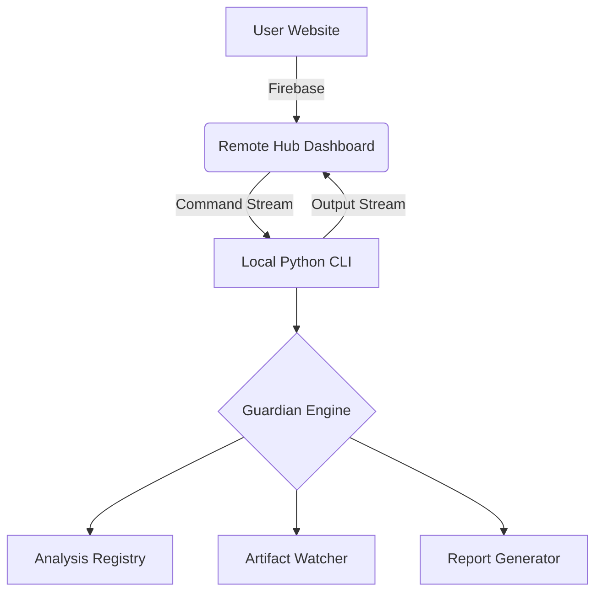

# 🏛️ ForArch - Forecast Archaeology Engine

<p align="center">
  
  
  
  
</p>

---

## 🧐 Mi az a ForArch?

A **ForArch (Forecast Archaeology)** egy modern, teljeskörű projekt-auditáló és karbantartó ökoszisztéma. Nem csak egy statikus elemző, hanem egy **"Digitális Régész"**, amely képes feltárni a projektjeidben rejtőző technikai adósságokat, elévülő könyvtárakat és veszélyes kódmintákat, mielőtt azok összeomlást okoznának.

A rendszer két fő pilléren nyugszik: egy **ultragyors Python CLI motoron** és egy **felhőalapú Remote Hub Dashboardon**.

---

## ✨ Főbb Funkciók

### 🔍 1. Deep Scan Engine
*   **Összetett Vizsgálat**: NPM, PyPI és Maven manifest fájlok párhuzamos elemzése.
*   **Decay Forecasting**: Megjósolja, melyik könyvtár fog elavulni a letöltési statisztikák és a GitHub aktivitás alapján.
*   **Static Analysis**: Mély kódvizsgálat a "legacy" minták és elavult API hívások után.

### 🛡️ 2. Guardian Modul
*   **Project Supervision**: Figyeli a megadott útvonalaidat és azonnal jelez, ha egy projekt "rohadni" kezd.
*   **Auto-Remediation**: Képes automatizált fix-scriptek generálására és a függőségek biztonságos frissítésére.
*   **Archiválás**: Automatikusan felismeri és tömöríti (ZIP) az inaktív, régi munkáidat.

### 🌐 3. Remote Hub Dashboard
*   **Cloud Command & Control**: Irányítsd a gépvázon futó CLI-t bárhonnan a webes felületen keresztül.
*   **Real-time Streaming**: A terminál kimenete (színekkel együtt!) élőben streamelhető a webre.
*   **Smart Session**: Folyamatos szinkronizáció a Firebase alapú távoli kapcsolattal.

---

## 🚀 Telepítés és Indítás

### Követelmények
- Python 3.8+
- Node.js (a webes felülethez)
- Firebase Account (a Remote Hub funkcióhoz)

### Lépések
1.  **Repo klónozása**:
    ```bash
    git clone https://github.com/CsikSzabi04/forarch.git
    cd forarch
    ```

2.  **CLI beállítása**:
    ```bash
    pip install -r requirements.txt
    python forarch.py check-env
    ```

3.  **Web Dashboard indítása**:
    ```bash
    cd website
    npm install
    npm run dev
    ```

---

## 🎮 Használat

### Helyi CLI parancsok
- `python forarch.py scan --dir .` -> Teljes szkennelés a jelenlegi mappában.
- `python forarch.py guardian scan` -> Interaktív projekt-felügyeleti menü indítása.
- `python forarch.py watch` -> Valós idejű "Radar" mód indítása.

### Távirányítás (Remote Hub)
A webről küldhető speciális parancsok:
| Parancs | Leírás |
| :--- | :--- |
| `/stop` | Azonnali leállítás. |
| `/rewrite` | Újraindítás és visszatérés a főmenübe (Session megtartásával). |
| `/save` | Aktuális logok mentése verziózva a `Scan Results` mappába. |
| `/clear` | Terminál képernyő ürítése. |
| `/manual` | Megnyitja a távoli útmutatót a gépeden. |

---

## 🛠️ Architektúra



---

## 💎 Design és Vizuális Élmény

A ForArch nem csak funkcionális, hanem látványos is. A **Rich** library segítségével a terminál kimenet modern, színes és könnyen olvasható (ikonokkal, táblázatokkal és ASCII bannerrel).

---

## 📜 Licenc

Ez a projekt az **MIT Licenc** alatt érhető el.

---
<p align="center">
  <b>ForArch - Mert a kódod is megérdemli a régészeti gondoskodást. ⚡</b>
</p>
