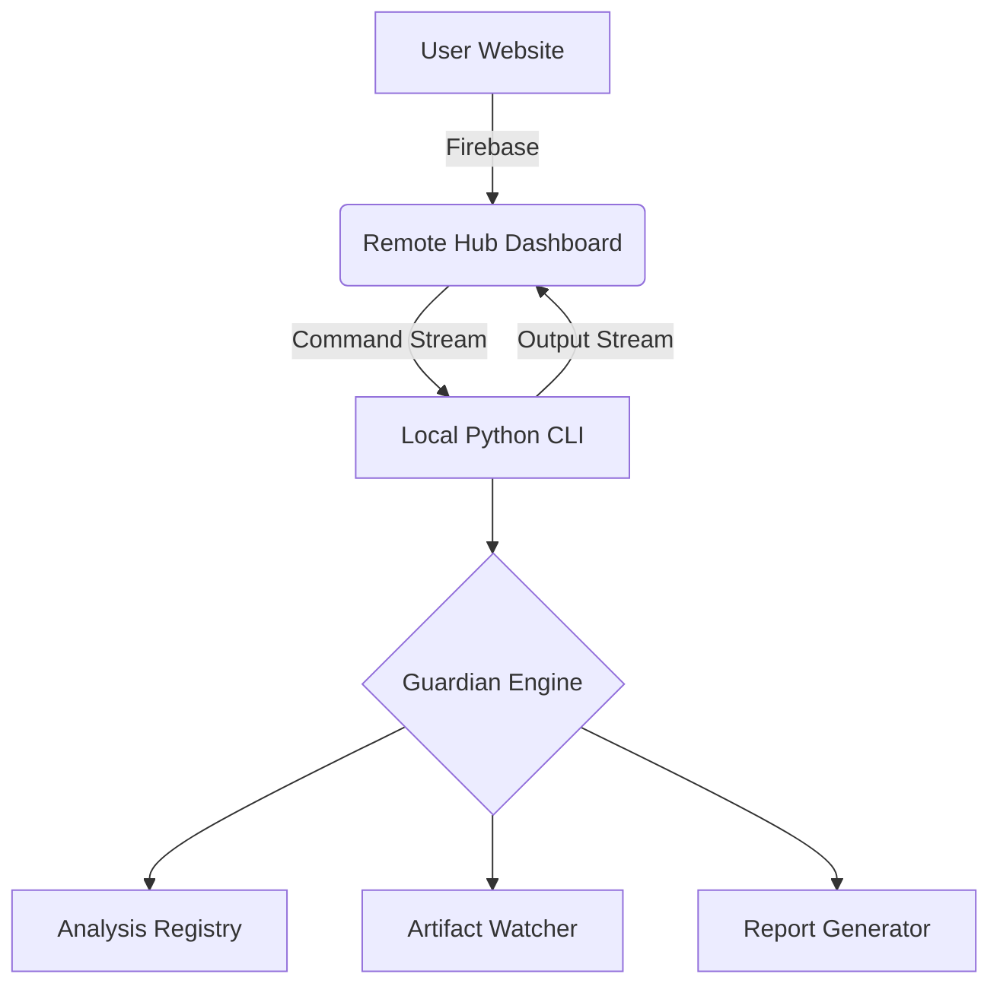

# 🏛️ ForArch - Forecast Archaeology Engine

<p align="center">
  
  
  
  
</p>

---

## 🧐 What is ForArch?

**ForArch (Forecast Archaeology)** is a modern, comprehensive project auditing and maintenance ecosystem. It's not just a static analyzer, but a **"Digital Archaeologist"** capable of uncovering hidden technical debt, decaying libraries, and dangerous code patterns in your projects before they cause a collapse.

The system is built on two main pillars: an **ultra-fast Python CLI engine** and a **cloud-based Remote Hub Dashboard**.

---

## ✨ Key Features

### 🔍 1. Deep Scan Engine
*   **Comprehensive Analysis**: Parallel analysis of NPM, PyPI, and Maven manifest files.
*   **Decay Forecasting**: Predicts which libraries will become legacy based on download statistics and GitHub activity.
*   **Static Analysis**: Deep code inspection for "legacy" patterns and deprecated API calls.

### 🛡️ 2. Guardian Module
*   **Project Supervision**: Monitors your specified paths and alerts you immediately if a project starts to "rot".
*   **Auto-Remediation**: Capable of generating automated fix scripts and securely updating dependencies.
*   **Archiving**: Automatically identifies and compresses (ZIP) inactive, old projects.

### 🌐 3. Remote Hub Dashboard
*   **Cloud Command & Control**: Control the CLI running on your machine from anywhere through the web interface.
*   **Real-time Streaming**: Terminal output (with colors preserved!) is streamed live to the web.
*   **Smart Session**: Continuous synchronization via Firebase-based remote connection.

---

## 🚀 Installation & Setup

### Requirements
- Python 3.8+
- Node.js (for the web interface)
- Firebase Account (for Remote Hub functionality)

### Steps
1.  **Clone the Repo**:
    ```bash
    git clone https://github.com/CsikSzabi04/forarch.git
    cd forarch
    ```

2.  **CLI Setup**:
    ```bash
    pip install -r requirements.txt
    python forarch.py check-env
    ```

3.  **Launch Web Dashboard**:
    ```bash
    cd forarch/website
    pnpm install
    pnpm run dev
    ```

---

## 🎮 Usage

### Local CLI Commands
- `python forarch.py scan --dir .` -> Full scan in the current directory.
- `python forarch.py guardian scan` -> Launch interactive project supervision menu.
- `python forarch.py watch` -> Start real-time "Radar" mode.

### Remote Control (Remote Hub)
Special commands available from the web:
| Command | Description |
| :--- | :--- |
| `/stop` | Immediate shutdown. |
| `/rewrite` | Restart and return to main menu (preserving the session). |
| `/save` | Save current logs with versioning to the `Scan Results` folder. |
| `/clear` | Clear terminal screen. |
| `/manual` | Open the remote guide on your machine. |

---

## 🛠️ Architecture



---

## 💎 Design and Visual Experience

ForArch is not only functional but also visually stunning. Using the **Rich** library, terminal output is modern, colorful, and easy to read (featuring icons, tables, and an ASCII banner).

---

## 📜 License

This project is available under the **MIT License**.

---
<p align="center">
  <b>ForArch - Because your code deserves archaeological care too. ⚡</b>
</p>
